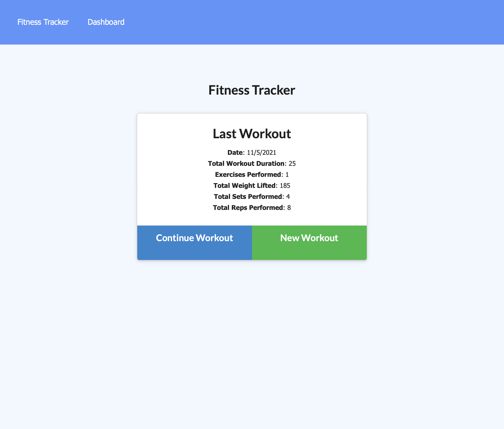
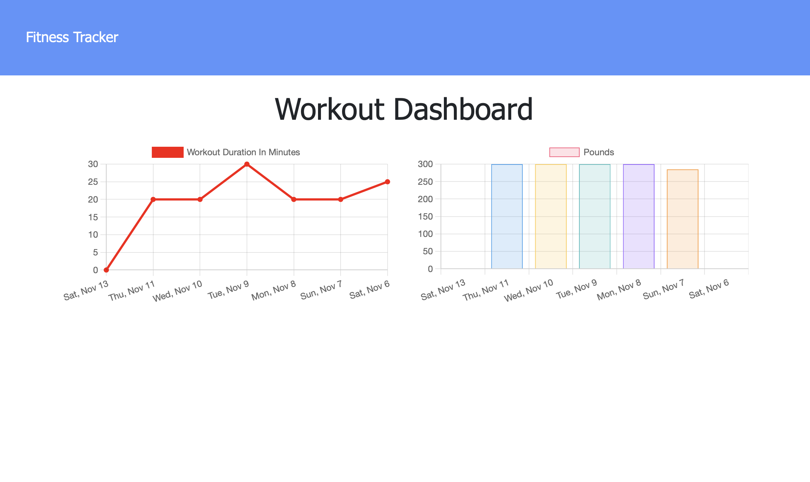
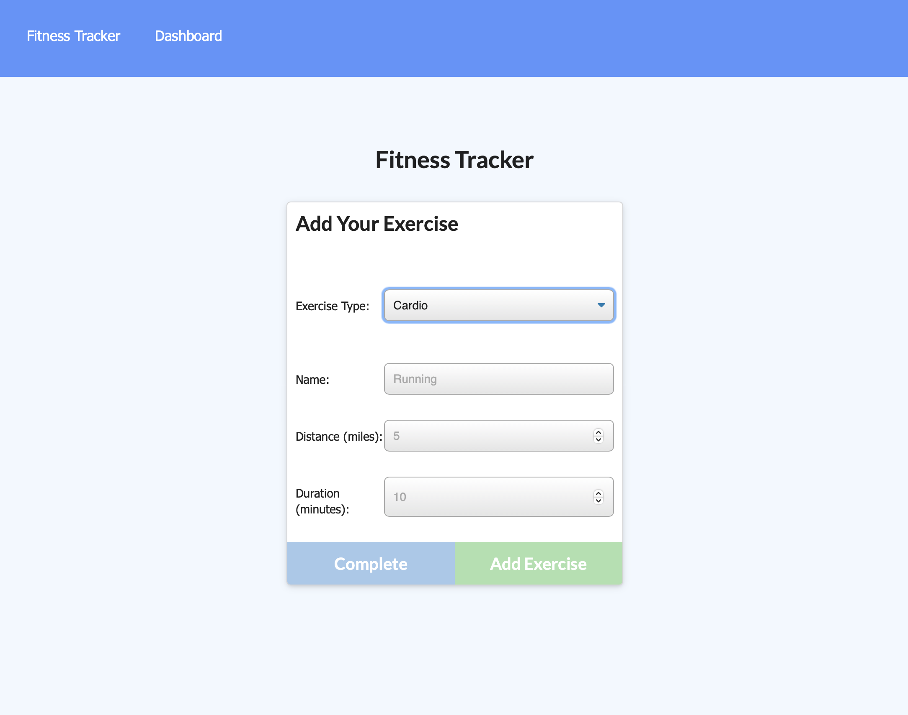

# Workout Tracker

## Description

This application allows users to easily create a new workout and modify the current workout. It also allows users to see the past workouts in a chart. The objective of the app is to help the  consumer reach their fitness goals more quickly because they can track their workout progress.

## Table of Contents

- [Usage](#usage)
- [License](#license)
- [How to Contribute](#contribute)
- [Questions](#questions)

 
 
  
  ## Usage
After entering into the website, you can do the following.

1. See the Dashboard.

2. Add a new Workout

3. Modify the current workout.

## Website Pictures
 

### Below you will see the first page of this application

 

### Below you will see the Dashboard 

 

 

### Below you will see the view when creating a new workout

 

# Website URL

https://floating-ocean-33123.herokuapp.com/?id=618f30f0e5d02e292e20f9d4

## License

The license used for this project: MIT

## Contribute

If you would like to contribute please contact me!

## Questions

To reach me please contact me in the email address below!

- GitHub: https://github.com/KarenHarley
- Email: karenharley88@gmail.com
